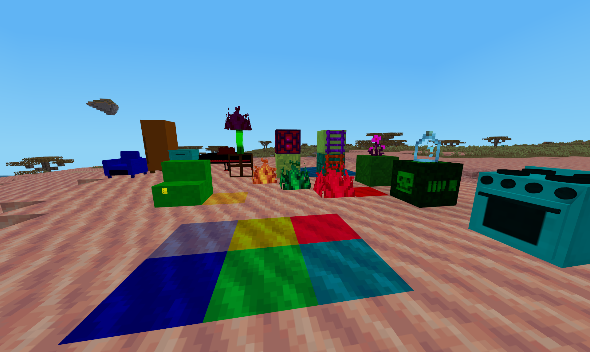

**This is a fresh project start and very much work in progress**
_honestly the progress might converge to zero when I loose intrest._

### What is this?

The all_colors mod for minetest allows players and mod-makers to fully utilize the potential
that hardware-coloring via param2 brings. It can even override most nodes that
don't support hardware-coloring to forcefully make them.

### Why is this?

The mod was heavily inspired by the unifieddyes mod from VanessaE.
While unifieddyes is a proven and extensive solution for modmakers,
this mod aims to offer the following

##### Improvements:

- hardly any effort for mod creators
- arbitrary pallets
- no registered node multiplication
- no leftover unknown nodes after removing the mod
- easy to use for players
- default overrides that make some existing nodes colorable out of the box

##### Shortcomings by design:

- Since we are using arbitrary colors and not one fixed palette the detailed
  color crafting unifieddyes has is not possible.
- colorfacedir nodes are restricted to 8 (arbitrary) colors
- colorwallmounted nodes are restricted to 32 (arbitrary) colors

The latter two are actually an advantage in my eyes, since unifieddyes splits the
256 color palette into chunks of 8 colors and then registers a node copy with
only a difference in palette. This leads to node multiplication and you can
quickly reach the current node registration limit of the engine.

In a 256 color palette most colors are not desireable options for any given node.
Since the mod creator can freely choose 8 colors for his item these colors will
all fit the node perfectly.

If you still desire more colors you can always define a new node.
Think of chair_red with 8 shades of red and then another defined node
chair_purple with 8 shades of purple.

### What does a mod author have to do to be compatible with this mod?

Almost nothing. You only need to make sure to define a palette for your node
and set an appropriate paramtype2 out of `{"color", "colorwallmounted","colorfacedir"}`

_In fact this mod should be compatible with all nodes that are already hardware colorized_

**Hint:** If you only want a part of your texture colored do make a copy of the
texture, replace the part you want colored with alpha and use the new texture
as an overlay (with `overlay_tiles`) same way you did for the base-texture.

### Caveats

This mod makes it possible to color nodes that where never designed to be colored
(not white) this can lead to very interesting and visually pleasing results,
but because of the way hardware coloring works you cant get every color for
such nodes.

**Example:**
>If you overlay a yellow mese block with blue, you will inevitably end up with
green - the mixture of both according to my kindergarden teacher. You cannot
make it blue no matter how much you want it. You can however define a
new decolorized mese-texture and make param2 'yellow' by default with 255
other options remaining.

If the user is using a custom texturepack the color will be applied to _his_ custom
version of the texture which may look better or worse but rarely the same.

### Compatibility

- Currently there are no hard issues known
- mods that override the usage of param2 are a hypothetical problem but only if
  they do it carelessly

_It can work for nodes that have been colored by unifieddyes
though the airbrush does some magic node-switcheroos and paramtype2 setting so
it may not work before the first use of the airbrush and the palettes may be confusing
due to the aforementioned node multiplication.
It is not recommended to use this mod in conjuction with unifieddyes but you
may want to keep it around to avoid undefined nodes on your map._

### Usage

Generally: Just switch it on.

**by default the mod has set its option `colorize_all` set for demonstration purposes.**
I call this _the nuclear option_ because it makes everything colorable that
can possibly made hardware-colorable. Better switch it off as soon as you are done
running around coloring stuff like a complete maniac.

The mod does some default overrides to make alot of stuff colorable out of the
box. This may not always be desireable (who doesn't like pink aspen trees?)
and can be disabled in the init.lua and of course you can add your own overrides.

If you are not in creative mode you will need to craft a paint can using
the shapeless recipe:
`red, green, blue, yellow, cyan, magenta, white, black and a steel ingot`
otherwise just grab a can of paint from the creative menu and (shift-)right-click
some lightly colored nodes, such as sandstone. The menu will present you the color
options (if any) that this node has, you select one and then punch the node.

You can punch away on as many nodes as you like, but when that node uses
a different palette the color will be whatever that node defined in its palette.

#### For mod authors

This mod primarily is useful to reduce the number of node definitions.
At the same time it multiplies your options. For example in the texturepack I use
default:stone looks like Bark when colored in different shades of brown, or like
a dense hedge in green colors.

#### Disabling / Re-enabling the mod

- Any items that have their own palette defined will remain in their current state.
- Any item that had a default palette assigned by this mod will visually fall back to its base color.
- no nodes - (apart from testnodes) should become unregistered.
- As long as no one else uses the param2 of any given node for something else,
  it will regain its color upon reactivation of this mod.
